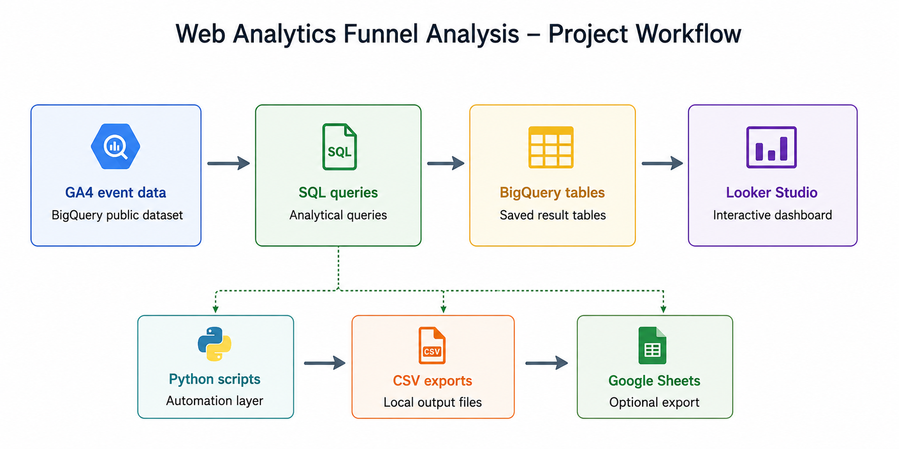
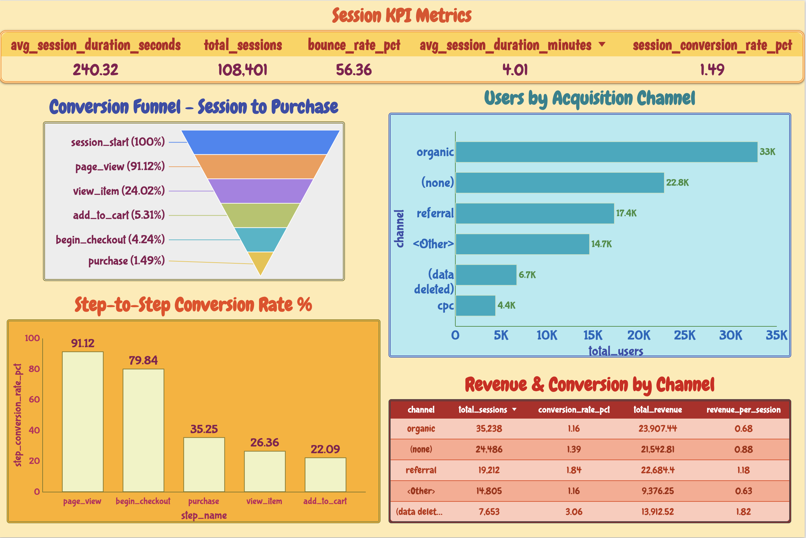

# Web Analytics Funnel Analysis

An academic data analytics portfolio project analyzing user acquisition, conversion funnel behavior, and session metrics using Google's public GA4 e-commerce dataset in BigQuery - visualized in Looker Studio.

---

## Workflow



---

## What This Project Is About

Every website loses visitors before they reach a goal - a purchase, a signup, a download. The question every business needs answered is: where exactly are people leaving, and why?

This project builds a full analytical system to answer that question using real-world data. It uses Google's public Google Analytics 4 dataset - actual anonymized event data from the Google Merchandise Store (Google's own online shop at shop.merch.google) - to analyze:

- **User Acquisition** - which traffic channels bring the most users and which bring the most valuable users
- **Conversion Funnel** - tracking sessions across 6 steps from session start to purchase, identifying exactly where and how many users drop off at each step
- **Session Behavior** - how long users stay, how many pages they visit, what percentage bounce immediately, and what percentage convert
- **Channel Revenue Performance** - which acquisition channels generate the most revenue and have the highest conversion rates

The analysis is done entirely with SQL in BigQuery, automated with Python, and visualized in an interactive Looker Studio dashboard - the same tech stack used by data analysts at tech and e-commerce companies. The project demonstrates core data analytics competencies: SQL querying, cloud data warehousing, pipeline automation, testing, CI/CD, and data visualization.

---

## Dataset

**Source:** `bigquery-public-data.ga4_obfuscated_sample_ecommerce`

This is a real, publicly available dataset maintained by Google containing anonymized event-level data from the Google Merchandise Store. It is stored in BigQuery as one table per day, named `events_YYYYMMDD`.

**Analysis period:** November 2020 (`20201101` to `20201130`)

**Scale:**
- 108,285 total sessions analyzed
- 6 funnel steps tracked per session
- 6 acquisition channels compared
- 1,617 purchases recorded

**Key dataset facts:**
- Every row is one event - one action by one user at one moment in time
- Users are identified by `user_pseudo_id` - an anonymized identifier, never a real name or email
- Traffic source is stored in `traffic_source.medium` (organic, cpc, referral etc.)
- Event parameters are stored in a nested `event_params` array - requires `UNNEST` in SQL to access individual values
- Timestamps are stored in microseconds since Unix epoch - divide by 1,000,000 to convert to seconds

---

## Project Structure

```
web-analytics-funnel/
│
├── .env.example                       # Template showing required environment variables.
│                                       # Copy this to .env and fill in your values.
│                                       # Never commit the actual .env file.
│
├── .gitignore                         # Tells Git which files to never upload to GitHub.
│                                       # Covers .env, credentials, venv, and system files.
│
├── README.md                          # This file. Complete project documentation.
│
├── requirements.txt                   # All Python packages needed to run this project.
│                                       # Install with: pip install -r requirements.txt
│
├── credentials/
│   └── service-account.json           # Google Cloud service account key (never committed).
│
├── sql/
│   ├── 01_user_acquisition.sql        # Counts users, sessions, new vs returning users
│   │                                  # broken down by traffic channel.
│   │                                  # Output: one row per channel.
│   │
│   ├── 02_funnel_analysis.sql         # Session-based funnel: assigns each session the
│   │                                  # highest funnel step it reached across 6 steps
│   │                                  # from session_start to purchase. Calculates
│   │                                  # drop-off counts and conversion rates at each step.
│   │                                  # Output: one row per funnel step (6 rows).
│   │
│   ├── 03_session_behavior.sql        # Aggregates session-level metrics across all
│   │                                  # sessions: total sessions, average duration,
│   │                                  # pages per session, bounce rate, conversion rate.
│   │                                  # Output: one summary row.
│   │
│   └── 04_conversion_by_channel.sql   # Joins session data with purchase events to show
│                                      # revenue, converting sessions, and conversion rate
│                                      # broken down by acquisition channel.
│                                      # Output: one row per channel.
│
├── python/
│   ├── run_queries.py                 # Connects to BigQuery using the service account
│   │                                  # credentials from your .env file, runs all 4 SQL
│   │                                  # queries programmatically, and saves results as
│   │                                  # CSV files in an outputs/ folder.
│   │
│   └── export_to_sheets.py            # Reads the CSV output files and uploads them to
│                                      # a Google Sheet tab by tab. Useful as an
│                                      # alternative data source for Looker Studio.
│
├── outputs/
│   ├── user_acquisition.csv           # Output of 01_user_acquisition.sql
│   ├── funnel_analysis.csv            # Output of 02_funnel_analysis.sql
│   ├── session_behavior.csv           # Output of 03_session_behavior.sql
│   └── conversion_by_channel.csv      # Output of 04_conversion_by_channel.sql
│
├── tests/
│   └── test_queries.py                # Unit tests using pytest that validate CSV output
│                                      # files after queries run. Checks required columns
│                                      # exist, metrics fall within valid ranges, and
│                                      # funnel steps decrease monotonically.
│
├── .github/
│   └── workflows/
│       └── ci.yml                     # GitHub Actions CI/CD pipeline. Runs automatically
│                                      # on every push to main or develop. Lints Python
│                                      # code with flake8 and executes all unit tests.
│
├── docs/
│   └── optimization_recommendations.md  # Business insights and prioritized action plan
│                                        # based on funnel analysis findings.
│
└── screenshots/
    ├── workflow_diagram.png           # Project workflow diagram shown above.
    ├── Looker_studio_Report.png       # Screenshot of the final Looker Studio dashboard.
    └── sql_queries_execution_screenshots/  # Screenshots of each SQL query running in BigQuery.
```

---

## Tech Stack

| Tool | Purpose | Why This Tool |
|------|---------|---------------|
| **BigQuery** | Cloud data warehouse - runs SQL on GA4 event data | Handles millions of rows instantly, free tier available, native GA4 integration |
| **SQL** | Query language to extract, transform, and analyze data | Industry standard for all data analyst roles |
| **Google Analytics 4** | Source of raw event-level user behavior data | Real-world web analytics platform used by millions of websites globally |
| **Python** | Automates query execution and data export | Removes manual copy-paste work, makes the pipeline reproducible |
| **Looker Studio** | Dashboard and data visualization | Free, connects natively to BigQuery, widely used in industry |
| **GitHub Actions** | CI/CD - runs automated tests on every push | Industry practice for maintaining code quality |
| **pytest** | Unit testing framework | Validates that query outputs are structurally correct and within expected ranges |

---

## Setup Instructions

### Prerequisites

Before starting, confirm you have the following on your Mac:

- A Google account (Gmail)
- Python 3.11 or higher - check by running `python3 --version` in Terminal
- Homebrew - check by running `brew --version` in Terminal
- Git - check by running `git --version` in Terminal
- Cursor IDE installed

---

### Step 1: Clone the Repository

Open Terminal and run the following commands one at a time:

```bash
cd ~/Desktop
git clone https://github.com/YOUR_USERNAME/web-analytics-funnel.git
cd web-analytics-funnel
```

Replace `YOUR_USERNAME` with your actual GitHub username.

---

### Step 2: Create and Activate a Virtual Environment

```bash
python3 -m venv venv
source venv/bin/activate
```

You will see `(venv)` appear at the start of your Terminal line. This means the virtual environment is active. Every time you open a new Terminal session to work on this project, run `source venv/bin/activate` first before running any other command.

---

### Step 3: Install Dependencies

```bash
pip install -r requirements.txt
```

This installs all required Python packages listed in `requirements.txt` into your virtual environment.

---

### Step 4: Set Up Google Cloud Project

1. Go to `https://console.cloud.google.com`
2. Sign in with your Google account
3. Click the project dropdown at the top → click **New Project**
4. Name it `web-analytics-funnel` → click **Create**
5. In the top search bar, type `BigQuery API` → click it → click **Enable**

---

### Step 5: Create a Service Account and Download Credentials

1. In Google Cloud Console, click the hamburger menu (top left) → **IAM & Admin** → **Service Accounts**
2. Click **+ Create Service Account**
3. Name: `web-analytics-funnel` → click **Create and Continue**
4. Add two roles:
   - Search for and select **BigQuery Data Viewer**
   - Click **+ Add Another Role** → select **BigQuery Job User**
5. Click **Continue** → click **Done**
6. Click on the service account email address → click the **Keys** tab
7. Click **Add Key** → **Create New Key** → select **JSON** → click **Create**
8. A JSON file downloads to your Downloads folder
9. Move it to your project:

```bash
mkdir -p ~/Desktop/web-analytics-funnel/credentials
mv ~/Downloads/*.json ~/Desktop/web-analytics-funnel/credentials/service-account.json
```

---

### Step 6: Set Up Environment Variables

```bash
cp .env.example .env
```

Open `.env` in Cursor and fill in your values:

```
GCP_PROJECT_ID=your-actual-project-id
BQ_DATASET=analytics_results
GOOGLE_SHEET_ID=your-sheet-id-here
GOOGLE_APPLICATION_CREDENTIALS=/Users/YOUR_MAC_USERNAME/Desktop/web-analytics-funnel/credentials/service-account.json
```

**How to find each value:**
- `GCP_PROJECT_ID` - go to `console.cloud.google.com` → click the project dropdown → copy the value in the **ID** column (looks like `web-analytics-funnel-123456`)
- `YOUR_MAC_USERNAME` - run `whoami` in Terminal and use whatever it prints
- `GOOGLE_SHEET_ID` - create a new Google Sheet at `sheets.google.com` → copy the long string from the URL between `/d/` and `/edit`

---

### Step 7: Test Your Google Cloud Connection

Run this in Terminal to confirm Python can connect to BigQuery using your credentials:

```bash
python3 -c "
from google.cloud import bigquery
from google.oauth2 import service_account
import os
from dotenv import load_dotenv
load_dotenv()
creds = service_account.Credentials.from_service_account_file(
    os.getenv('GOOGLE_APPLICATION_CREDENTIALS'),
    scopes=['https://www.googleapis.com/auth/bigquery']
)
client = bigquery.Client(project=os.getenv('GCP_PROJECT_ID'), credentials=creds)
print('Connected successfully - project:', client.project)
"
```

If you see `Connected successfully` the setup is working. If you see an error, double-check the path in `GOOGLE_APPLICATION_CREDENTIALS` in your `.env` file.

---

### Step 8: Run the SQL Queries in BigQuery

1. Go to `console.cloud.google.com` → click **BigQuery** in the left menu
2. Click **+ Compose new query** in the center editor panel
3. Open each file from the `sql/` folder in Cursor → copy the entire contents
4. Paste into the BigQuery editor → click the blue **Run** button
5. After results appear at the bottom, click **Save Results** → **BigQuery Table**
6. Select your project and dataset (`analytics_results`) → name the table exactly as shown:

| SQL File | Save as Table Name |
|---|---|
| `01_user_acquisition.sql` | `user_acquisition` |
| `02_funnel_analysis.sql` | `funnel_analysis` |
| `03_session_behavior.sql` | `session_behavior` |
| `04_conversion_by_channel.sql` | `conversion_by_channel` |

---

### Step 9: Run Python Scripts (Optional)

To run all queries automatically via Python instead of manually in BigQuery:

```bash
python python/run_queries.py
```

Results are saved as CSV files in the `outputs/` folder.

To export results to Google Sheets:

```bash
python python/export_to_sheets.py
```

Note: the service account email (found in your JSON file as `client_email`) must be shared as an Editor on your Google Sheet before this script will work.

---

### Step 10: Run Tests

```bash
pytest tests/ -v
```

Tests will show as PASSED, FAILED, or SKIPPED. SKIPPED means the CSV output files have not been generated yet - run `python python/run_queries.py` first.

---

## Key Findings

Based on November 2020 data from the Google Merchandise Store:

| Metric | Value |
|--------|-------|
| Total Sessions | 108,285 |
| Total Purchases | 1,617 |
| Overall Conversion Rate | 1.49% |
| Biggest Funnel Drop-off | Page View → View Item (73.64% of sessions lost) |
| Bounce Rate | 56.36% |
| Avg Session Duration | 4.01 minutes |
| Avg Pages per Session | 4.19 |
| Highest Revenue Channel | Organic ($23,907 total) |
| Best Conversion Rate Channel | (data deleted) at 3.06% |

---

## Dashboard

The published Looker Studio dashboard contains 5 charts:

1. **Scorecard row** - total sessions, bounce rate, average session duration, conversion rate
2. **Funnel chart** - sessions at each of the 6 funnel steps from session start to purchase
3. **Bar chart** - total users by acquisition channel
4. **Table** - revenue, converting sessions, and conversion rate broken down by channel
5. **Bar chart** - step-to-step conversion rate percentage at each funnel step

 

**[View Live Interactive Dashboard](https://datastudio.google.com/reporting/0036886d-8b9c-4cc0-a4d0-685e57d90447)**
---
